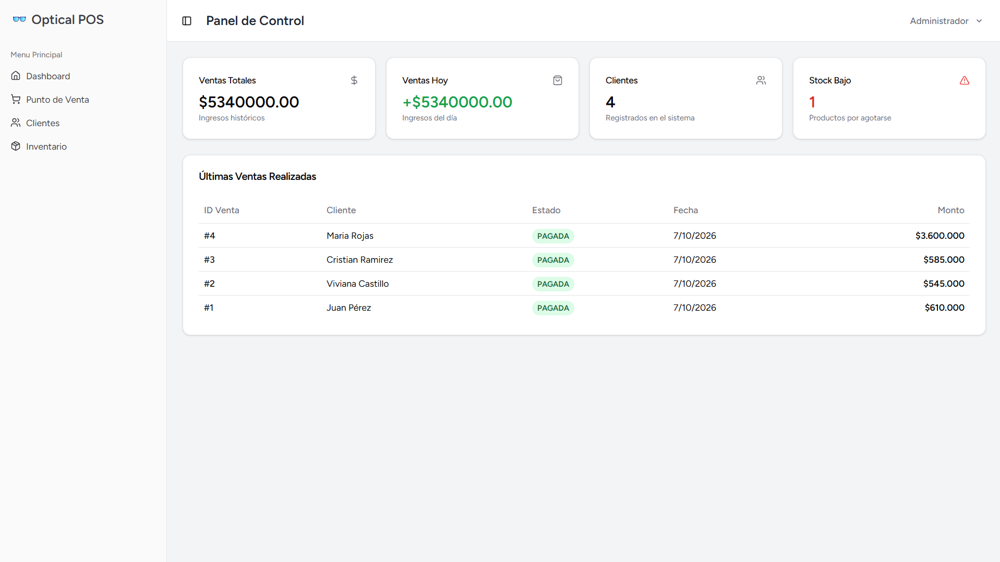
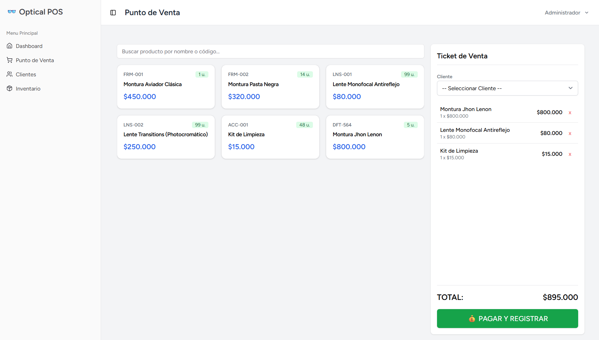
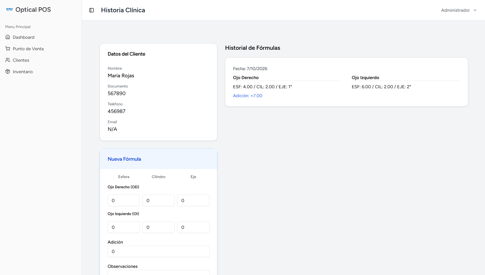
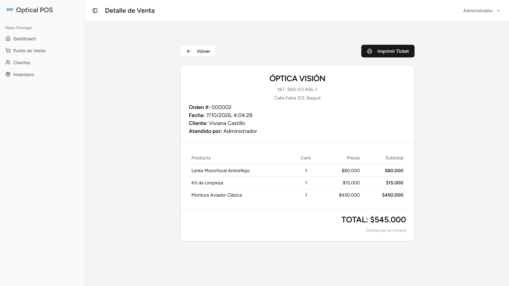
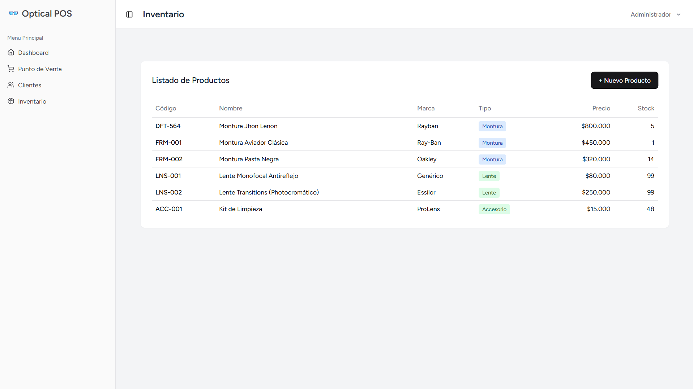

# POS para óptica

Aplicación web de punto de venta desarrollada para gestionar las operaciones básicas de una óptica.

El sistema permite administrar productos y clientes, registrar fórmulas ópticas, realizar ventas con control de inventario, consultar los comprobantes generados y visualizar indicadores generales mediante un dashboard.

Este proyecto fue desarrollado como proyecto práctico y posteriormente revisado y mejorado con el objetivo de consolidar buenas prácticas de desarrollo con Laravel, React y bases de datos relacionales.

## Capturas de pantalla

### Dashboard



### Punto de venta



### Cliente y fórmulas ópticas



### Comprobante de venta



### Inventario



## Funcionalidades

### Productos
- Registro y consulta de productos.
- Manejo de precio y existencias.
- Validación de precios y cantidades de inventario.
- Identificación de productos con bajo stock.

### Clientes
- Registro y consulta de clientes.
- Consulta individual de información del cliente.
- Registro de fórmulas o prescripciones ópticas asociadas al cliente.

### Punto de venta
- Selección de productos y cantidades mediante un carrito de compra.
- Selección obligatoria de un cliente para registrar la venta.
- Cálculo del valor de la venta en el servidor.
- Validación de productos, cantidades y disponibilidad de inventario.
- Descuento automático de existencias después de una venta.
- Generación y consulta del comprobante de venta.

### Dashboard
- Indicadores generales de ventas.
- Información de clientes.
- Seguimiento de productos con bajo inventario.
- Consulta de ventas recientes.

### Usuarios
- Autenticación mediante usuario y contraseña.
- Actualización de perfil y contraseña.
- Acceso al sistema restringido a usuarios previamente creados.

El registro público y la eliminación directa de cuentas están deshabilitados debido al carácter interno del sistema y a la necesidad de conservar la trazabilidad de las ventas.

## Tecnologías

### Backend
- PHP 8.4
- Laravel 12
- Eloquent ORM
- Pest / PHPUnit

### Frontend
- React 18
- TypeScript
- Inertia.js 2
- Tailwind CSS
- Radix UI
- Vite

### Datos e infraestructura de desarrollo
- MySQL 8
- Docker
- Laravel Sail
- Git / GitHub

## Decisiones técnicas relevantes

### Integridad de las ventas
Los precios utilizados para registrar una venta se obtienen desde la base de datos y no desde los valores enviados por el navegador. De esta forma, el servidor conserva el control sobre el cálculo del total.

Cada detalle de venta almacena además el precio correspondiente al momento de realizar la operación, permitiendo conservar el valor histórico aunque posteriormente cambie el precio del producto.

### Transacciones y control de inventario
El registro de una venta y la actualización del inventario se realizan dentro de una transacción de base de datos.

Durante este proceso se utiliza bloqueo de filas (`lockForUpdate`) sobre los productos involucrados para evitar que dos operaciones concurrentes puedan consumir simultáneamente las mismas existencias.

Si la operación no puede completarse, la transacción se revierte y se evita dejar una venta o un inventario parcialmente actualizado.

### Validación en el servidor
Aunque la interfaz realiza sus propias validaciones, las reglas que afectan la integridad de la información también se aplican en Laravel.

Entre ellas se encuentran:
- existencia de los productos;
- cantidades enteras y positivas en las ventas;
- precios no negativos;
- inventario no negativo;
- disponibilidad suficiente antes de completar una venta.

### Base de datos de pruebas
Las pruebas automatizadas utilizan MySQL, el mismo motor empleado durante el desarrollo de la aplicación.

Se utiliza una base de datos independiente denominada `testing` para mantener las pruebas aisladas de los datos de desarrollo.

## Instalación

El entorno de desarrollo recomendado utiliza Docker y Laravel Sail.

### Requisitos
- Docker
- Docker Compose
- Git

> Los siguientes comandos están pensados para Linux o WSL2.

### 1. Clonar el repositorio

```bash
git clone git@github.com:GerKast/optical-pos.git
cd optical-pos
```

### 2. Crear el archivo de entorno

```bash
cp .env.example .env
```

### 3. Instalar Composer y Laravel Sail

En una instalación nueva todavía no existe el directorio `vendor`, por lo que las dependencias de PHP se instalan inicialmente utilizando Composer dentro de Docker:

```bash
docker run --rm \
    -u "$(id -u):$(id -g)" \
    -v "$(pwd):/var/www/html" \
    -w /var/www/html \
    composer:2 \
    composer install --ignore-platform-reqs
```

Este paso crea `vendor/` y permite utilizar Laravel Sail. La opción `--ignore-platform-reqs` se utiliza únicamente durante este bootstrap inicial; la aplicación se ejecuta posteriormente en el entorno PHP 8.4 definido por Sail.

### 4. Iniciar el entorno

```bash
./vendor/bin/sail up -d
```

### 5. Generar la clave de la aplicación

```bash
./vendor/bin/sail artisan key:generate
```

### 6. Crear la estructura y los datos de demostración

```bash
./vendor/bin/sail artisan migrate:fresh --seed
```

### 7. Instalar las dependencias del frontend

```bash
./vendor/bin/sail npm install
```

### 8. Ejecutar el frontend

Durante el desarrollo:

```bash
./vendor/bin/sail npm run dev
```

O para generar el build:

```bash
./vendor/bin/sail npm run build
```

La aplicación estará disponible por defecto en `http://localhost`.

## Usuario de demostración

Después de ejecutar los seeders puede utilizarse el siguiente usuario:

```text
Correo: admin@example.com
Contraseña: password
```

Estas credenciales son únicamente para el entorno local de demostración.

## Pruebas automatizadas

La aplicación incluye pruebas funcionales para autenticación y los principales módulos del sistema, incluyendo productos, clientes, ventas y dashboard.

Para ejecutar la suite:

```bash
./vendor/bin/sail artisan test
```

Las pruebas utilizan la base de datos MySQL `testing`, separada de la base de datos de desarrollo.

## Estructura general

```text
app/
├── Http/Controllers/     # Controladores de la aplicación
└── Models/               # Modelos Eloquent

database/
├── factories/            # Generación de datos para pruebas
├── migrations/           # Estructura de la base de datos
└── seeders/              # Datos de demostración

resources/js/
├── Pages/                # Vistas React / Inertia
├── components/           # Componentes reutilizables
└── Layouts/              # Layouts de la aplicación

tests/
├── Feature/              # Pruebas funcionales
└── Unit/                 # Pruebas unitarias
```

## Alcance del proyecto

Este repositorio corresponde a un proyecto de aprendizaje y portafolio orientado a demostrar el desarrollo de una aplicación web full-stack con Laravel y React.

El proyecto no pretende representar un sistema comercial listo para producción. Entre otros aspectos, no incluye:
- integración con pasarelas de pago;
- facturación electrónica;
- gestión avanzada de roles y permisos;
- integración con sistemas contables;
- despliegue productivo.

Los datos incluidos mediante seeders son utilizados únicamente con fines de desarrollo y demostración.

## Autor

**Germán Castañeda**

Ingeniero de Software
Especialización en Seguridad de la Información

GitHub: **GerKast**
